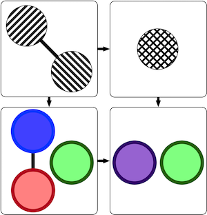

#   AlgebraicRewriting.jl

AlgebraicRewriting.jl is a Julia library for performing category-theoretic
rewrites over a broad class of data structures, defined in
[Catlab.jl](https://github.com/AlgebraicJulia/Catlab.jl).
This package defines DPO, SPO, and SqPO for C-Sets, as described in
[[Brown 2022](https://arxiv.org/abs/2111.03784)]. See the [documentation](https://algebraicjulia.github.io/AlgebraicRewriting.jl/dev/) for more details.

## NOTE
This library is currently under active development, and so is not yet at a
point where a constant API/behavior can be assumed. That being said, if this
project looks interesting/relevant please contact us and
[let us know](https://www.algebraicjulia.org/#contributing)!
