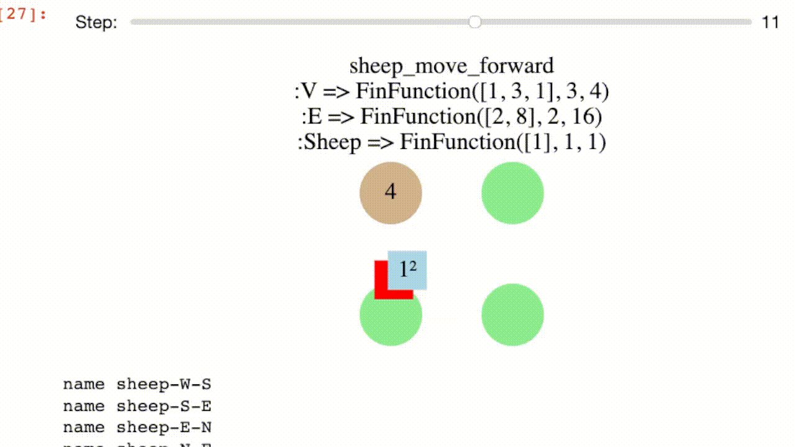

# AlgebraicRewriting.jl

Here we walk through basic examples of double-pushout (DPO), single-pushout (SPO), and sesqui-pushout (SqPO) rewriting. We also consider the rewriting of graphs, Petri nets, and 2D semisimplicial sets (which are all instances of rewriting in C-set categories) in addition to rewriting C-set slice categories and structured cospans of C-sets. Future work will allow us to perform rewriting of diagrams in C-set categories.


## Double pushout rewriting of graphs

This is the classic setting of graph transformation. Suppose we wish to rewrite this graph:

```julia
G = @acset Graph begin
    V=3; E=3;
    src=[1,2,2];
    tgt=[2,3,3]
end
to_graphviz(G; node_labels=true)
```

Our rewrite rule will look for parallel arrows and replace them with a loop.

```julia
L = @acset Graph begin V=2; E=2; src=1; tgt=1 end # matched pattern
I = @acset Graph begin V=2; E=1; src=1; tgt=1 end # interface: non-deleted subset of L
R = @acset Graph begin V=1; E=1; src=1; tgt=1 end # Replacement pattern
rul = Rule(hom(I,L), hom(I,R)) # Rewrite rule as span L ↩ I → R
to_graphviz(apply_rule(rul, G))
```

However, we are not limited to rewriting (directed multi-) graphs.

## Double pushout rewriting of triangle mesh

Suppose we want to perform rewriting on a mesh with triangles defined over certain triples of edges.

```julia
@present ThSemisimplicialSet  <: TheoryGraph begin
  T :: Ob
  (d1,d2,d3)::Hom(T,E)
  compose(d1, src) == compose(d2, src)
  compose(d1, tgt) == compose(d3, tgt)
  compose(d2, tgt) == compose(d3, src)
end
@acset_type SSet(ThSemisimplicialSet)

quadrangle = @acset SSet begin
    T=2; E=5; V=4
    d1=[1,1]; d2=[2,3]; d3=[4,5]
    src=[1,1,1,2,3]
    tgt=[4,2,3,4,4]
end
```

There is no difference in methodology despite the different schema: we provide an instance of the datatype to serve as our pattern for replacement.

```julia
L = quadrangle
I = @acset SSet begin # remove the triangles and the internal edge
  E=4; V=4
  src=[1,1,2,3]
  tgt=[2,3,4,4]
end
R = @acset SSet begin # re-add the triangles and edge, but perpendicular
  T=2; E=5; V=4
  d1=[2,3]; d2=[1,5]; d3=[5,4]
  src=[1,1,2,3,2]
  tgt=[2,3,4,4,3]
end
r = Rule(homomorphism(I, R; monic=true)
         homomorphism(I, L; monic=true))
```
We can construct a mesh to test this rewrite on by gluing together two
quadrilaterals via apushout along a common edge.
```julia
edge = @acset SSet begin E=1; V=2; src=[1]; tgt=[2] end
edge_left = homomorphism(edge, L; initial=Dict([:V=>[1,3]]))
edge_right = homomorphism(edge, L; initial=Dict([:V=>[2,4]]))
G = apex(pushout(edge_left, edge_right))
```

```julia
rewrite(r, G; monic=true)
```

## Applied example: Lotka-Volterra agent-based model

### Overview
The aim to recapture the dynamics of NetLogo's [Wolf Sheep predation](https://ccl.northwestern.edu/netlogo/models/WolfSheepPredation) model in terms of declarative rewrite rules, rather than standard code-based interfaced. This models wolves in sheeps living in a periodic 2D space, which is also covered by grass. Wolves eat sheep to gain energy, sheep eat grass to gain energy, and grass takes time to grow back after it has been eaten. Each wolf/sheep has a direction and is moving in that direction (veering left or right randomly with some probability). At some rate, wolves/sheep undergo mitosis and their energy is split in half. As the wolves/sheep move, they lose energy, and they die if they are eaten or run out of energy. The simulation could go on indefinitely, or it could be ended when one of the two species completely dies out.

The main difference with our reconstruction of the NetLogo model is that we model the 2D space as a discrete grid. This is more amenable to the style of pattern matching characteristic of AlgebraicRewriting, in contrast to floating point coordinates and collision checking to see when two entities occupy the same space.

### Defining the datatype we are rewriting

```julia
using Catlab, Catlab.Theories, Catlab.CategoricalAlgebra
using Catlab.Graphs.BasicGraphs: TheoryGraph, HasGraph
@present TheoryLV <: TheoryGraph begin # inherit Graph schema
  (Sheep,Wolf,Grass)::Ob               # three more types of entities
  (Dir, GrassVal, Eng)::AttrType       # three more types of attributes
  sheep_loc::Hom(Sheep, E)             # sheep live on edges
  wolf_loc::Hom(Wolf, E)               # wolves live on edges
  grass::Hom(Grass, V)                 # grass lives on vertices
  grassval::Attr(Grass,GrassVal)       # grass has an attribute
  dir::Attr(E, Dir)                    # edges have an attributes
  sheep_eng::Attr(Sheep, Eng)          # sheep have an attributes
  wolf_eng::Attr(Wolf, Eng)            # wolves have an attribute
end

@acset_type LV_Generic(TheoryLV) <: HasGraph  # inherit Graph API
const LV = LV_Generic{Union{Var,Expr,Symbol}, # Dir
                      Union{Var,Expr,Int},    # GrassVal
                      Union{Var,Expr,Int}}    # Eng
```

- `grassval == 0` means alive grass; `grassval > 0` represents the time
until the grass is alive.
- Sheeps and wolves have position and direction, so we assign each an *edge*.
    - We assume a convention where the vertex of a sheep/wolf is the edge *source*.
- `Dir` is an attribute which can take values `N`, `E`, `W`, and `S`.

There is a certain symmetry between wolves and sheep in the schema, which we can make explicit with the following endofunctor:

```julia
F = FinFunctor(
  Dict([:Sheep => :Wolf, :Wolf => :Sheep, :Grass => :Grass, :V=>:V, :E=>:E,
        :Dir=>:Dir, :GrassVal=>:GrassVal, :Eng=>:Eng]),
  Dict([:sheep_loc=>:wolf_loc, :wolf_loc=>:sheep_loc,
        :sheep_eng=>:wolf_eng, :wolf_eng=>:sheep_eng,
        :src=>:src,:tgt=>:tgt,:dir=>:dir,
        :grassval=>:grassval,:grass=>:grass]),
  TheoryLV, TheoryLV
)
```

We can apply `F` to a rewrite rule defined for sheep (e.g. that one dies when it has zero energy) and obtain the analogous rule for wolves without any effort.

### Rules and Schedules

We can declare a `Rule` and how we wish to schedule that rule.
The 'outer loop' is a `WhileSchedule` that executes all the rules in some order (i.e. a `LinearSchedule` wrapped around a list called `seq` made up of individual `RuleSchedule`s).

```julia
extinct(prev, curr) = nparts(curr, :Wolf) == 0 || nparts(curr, :Sheep) == 0
overall = WhileSchedule(ListSchedule(seq), :main, extinct, 10);
```

Let's show some of the things that went into `seq`. Below we define sheep reproduction to occur with probability 0.04 and wolf reproduction to occur with probability 0.05.

```julia
s_reprod_l =  @acset LV begin
  Sheep=1; V=2; E=1; src=1;tgt=2; dir=[Var(:d)];
  sheep_eng=[Var(:a)]; sheep_loc=1
end
```
This defines a *pattern* which we wish to match. The suffix `_l` indicates that this is the `L` of a rewrite rule, which is a partial map `L → R`, i.e. `L ↩ I → R`.

We need to define the interface `I`, which contains the subobject of `L` which is *not deleted*.

```julia
s_reprod_i = deepcopy(s_reprod_l); rem_part!(s_reprod_i, :Sheep, 1)
```
And the right object, `R`, includes things that are added. So we remove a sheep with energy `a` at a certain position and replace it with two sheep with `a/2` energy.

```julia
s_reprod_r = deepcopy(s_reprod_i)
add_parts!(s_reprod_r, :Sheep, 2; sheep_loc=[1,1],
           sheep_eng=[:(round(Int, a/2, RoundDown))])

sheep_reprod = Rule(hom(s_reprod_i,s_reprod_l),hom(s_reprod_i,s_reprod_r))
```

As mentioned before, we can turn this into a wolf reproduction rule by applying our functor. Then we add the two rules along with their probabilities. The `false` here refers to whether or not we apply the rule only once or whether we apply it for every match we find (which is what we want to do, to give each sheep a 4% chance of reproducing).

```julia
wolf_reprod = F(sheep_reprod)


append!(seq, [RuleSchedule(sheep_reprod,:sheep_reprod, false,0.04),
              RuleSchedule(wolf_reprod, :wolf_reprod, false,0.05)]);
```

Note that our pattern `L` can have `Var` variables, and our right hand side `R` can have Julia expressions involving those variables.

Another illustrative example is the 'move forward' rule. We simultaneously advance the sheep forward one space and decrement its energy by 1.

```julia
s_move_forward_l = @acset LV begin
  Sheep=1; V=3; E=2;
  src=[1,2]; tgt=[2,3]; dir=[Var(:a), Var(:a)]
  sheep_eng=[Var(:x)]; sheep_loc=1
end
```

This pattern has two contiguous edges that are in the same direction (implicitly constrainted by using `Var(:a)` twice) and the sheep in the first position.

```julia

s_move_forward_i = deepcopy(s_move_forward_l)
rem_part!(s_move_forward_i, :Sheep, 1)

s_move_forward_r = deepcopy(s_move_forward_i)
add_part!(s_move_forward_r, :Sheep; sheep_loc=2, sheep_eng=:(x-1))
```

We delete the sheep and recreate one in position #2, with one fewer energy.
This is only valid though if the sheep has any energy. To prevent this rule
from firing, we need a *negative application condition*. This embeds the
pattern `L` in a larger context `N` that has the semantics of: if `L` *and* `N`
are matched, then actually don't fire the rule. The pattern we want to avoid
is one where the sheep has zero energy.

```julia
zero_s = deepcopy(s_move_forward_l)
set_subpart!(zero_s, :sheep_eng, 0)

sheep_move_forward = Rule(hom(s_move_forward_i, s_move_forward_l),
                          hom(s_move_forward_i, s_move_forward_r),
                          [NAC(hom(s_move_forward_l,zero_s; bindvars=true))])

wolf_move_forward = F(sheep_move_forward)

append!(seq, [R(sheep_move_forward,:sheep_move_forward),
              R(wolf_move_forward, :wolf_move_forward)]);
```

In all these cases, automatic homomorphism finding is sufficient for obtaining
the morphism data of `L ↩ I → R`.

### Other functions
Functions to initialize and visualize the world-states are defined in the Jupyter notebook. Important functionality only possible in the notebook is the ability to move a slider and view the progression of a simulation.




## Alternative rewriting semantics
A nice property of DPO is that you can analyze the relationship between `I` and `L` to see exactly what will be deleted (likewise for `I` and `R` to see what will be added). However, this is sometimes not what we want: we wish to delete *outside the context* `L`, or to implicitly create things. The former is possible in single pushout rewriting, and both are possible in sesqui pushout rewriting.

### Single pushout rewriting
Implicit deletion works like a cascading delete: if you delete a vertex (for example), then you implicitly delete an edge which refers to that vertex (and a triangle that refers to that edge, and so on). Here we delete a triangle and a vertex explicitly, but implicitly the deleted vertex

```julia
Tri = @acset SSet begin
    T=1; E=3; V=3;
    d1=[1]; d2=[2]; d3=[3];
    src=[1,1,2]; tgt=[3,2,3]
end
L = Tri
r = Rule{:SPO}(homomorphisms(edge, L)[2],id(edge))
m = homomorphism(L, quadrangle)
# can_pushout_complement(r.L, m) == false
rewrite_match(r,m)
```

### Sesqui pushout rewriting

Here our rewrite rule takes a vertex and duplicates it.
```julia
L = @acset SSet begin V=1 end
I = @acset SSet begin V=2 end
r=Rule{:SqPO}(homomorphism(I,L),id(I))
```
With sesqui-pushout semantics, when we apply this to the vertex of a triangle,
this will create two triangles.

```julia
G = Tri
m = CSetTransformation(L, G, V=[1]);
nparts(sesqui_pushout_rewrite(l, r, m), :T) == 4 || error("We get 4 'triangles' when we ignore equations")
rewrite_match(r, m; pres=ThSemisimplicialSet) # pass in the equations
```

## Rewriting things that aren't C-Sets

Anything that implements some basic features (e.g. `pushout`, `pushout_complement`)
can be used with this rewriting infrastructure. Generally, constructions that
are built on top of C-Sets

### Slices

### Structured cospans

### Diagrams