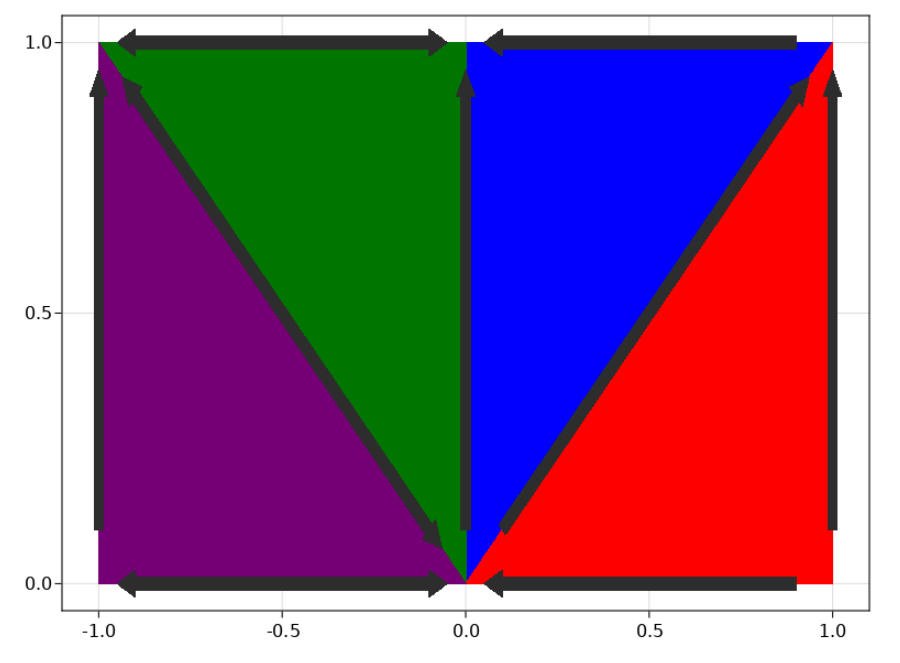

# AlgebraicRewriting.jl

Here we walk through basic examples of double-pushout (DPO), single-pushout
(SPO), and sesqui-pushout (SqPO) rewriting. We also consider the rewriting of
graphs, Petri nets, and 2D semisimplicial sets (which are all instances of
rewriting in C-set categories) in addition to rewriting C-set slice categories
and structured cospans of C-sets. Future work will allow us to perform rewriting
of diagrams in C-set categories.

## Double pushout rewriting of graphs

This is the classic setting of graph transformation. Suppose we wish to rewrite
this graph:

```@example X
using Catlab, Catlab.Graphs, Catlab.Graphics, Catlab.CategoricalAlgebra

G = @acset Graph begin
    V=3; E=3;
    src=[1,2,2];
    tgt=[2,3,3]
end
to_graphviz(G; node_labels=true) # hide
```

Our rewrite rule will look for parallel arrows

```@example X
L = @acset Graph begin V=2; E=2; src=1; tgt=2 end # matched pattern
to_graphviz(L; node_labels=true) # hide
```

Then remove one of the edges (by defining the *non-deleted* subpart of the
pattern as the following graph)

```@example X
I = @acset Graph begin V=2; E=1; src=1; tgt=2 end # interface: non-deleted subset of L
to_graphviz(I; node_labels=true) # hide
```

And lastly replacing the pattern with one that collapses the two matched
vertices to form a loop.

```@example X
R = @acset Graph begin V=1; E=1; src=1; tgt=1 end # Replacement pattern
to_graphviz(R; node_labels=true) # hide
```

We assemble this information into a rewrite rule by forming a span `L ↩ I → R`
```@example X
using AlgebraicRewriting
using AlgebraicRewriting: rewrite
const hom = AlgebraicRewriting.homomorphism
rule = Rule(hom(I,L), hom(I,R))
H = rewrite(rule, G)
to_graphviz(H; node_labels=true) # hide
```

Something to note here is that the result is only defined up to isomorphism,
e.g. the vertex which corresponded to vertex #1 in the original graph may not
be #1 in the result.

As the example `mesh.jl`, shows, we are not limited to rewriting
(directed multi-) graphs - we can rewrite triangle meshes with the same
methodology: we provide an instance of the datatype to serve as our pattern
for replacement (such as the quadrangle above) and then need an instance to
serve as our non-deleted subset of that pattern.




## Applied example: Lotka-Volterra agent-based model

### Overview
The aim to recapture the dynamics of NetLogo's
[Wolf Sheep predation](https://ccl.northwestern.edu/netlogo/models/WolfSheepPredation)
model in terms of declarative rewrite rules, rather than standard code-based
interfaced. This models wolves in sheeps living in a periodic 2D space, which is
also covered by grass. Wolves eat sheep to gain energy, sheep eat grass to gain
energy, and grass takes time to grow back after it has been eaten. Each
wolf/sheep has a direction and is moving in that direction (veering left or
right randomly with some probability). At some rate, wolves/sheep undergo
mitosis and their energy is split in half. As the wolves/sheep move, they lose
energy, and they die if they are eaten or run out of energy. The simulation
could go on indefinitely, or it could be ended when one of the two species
completely dies out.

The main difference with our reconstruction of the NetLogo model is that we
model the 2D space as a discrete grid. This is more amenable to the style of
pattern matching characteristic of AlgebraicRewriting, in contrast to floating
point coordinates and collision checking to see when two entities occupy the
same space.

### Defining the datatype we are rewriting

```@example X
using Catlab.Graphs.BasicGraphs: HasGraph # hide
@present TheoryLV <: SchGraph begin # inherit Graph schema
  (Sheep,Wolf,Grass)::Ob               # three more types of entities
  (Dir, GrassVal, Eng)::AttrType       # three more types of attributes
  sheep_loc::Hom(Sheep, E)             # sheep live on edges
  wolf_loc::Hom(Wolf, E)               # wolves live on edges
  grass::Hom(Grass, V)                 # grass lives on vertices
  grassval::Attr(Grass,GrassVal)       # grass has an attribute
  dir::Attr(E, Dir)                    # edges have an attributes
  sheep_eng::Attr(Sheep, Eng)          # sheep have an attributes
  wolf_eng::Attr(Wolf, Eng)            # wolves have an attribute
end

@acset_type LV_Generic(TheoryLV) <: HasGraph  # inherit Graph API
const LV = LV_Generic{Union{Var,Expr,Symbol}, # Dir
                      Union{Var,Expr,Int},    # GrassVal
                      Union{Var,Expr,Int}};   # Eng
```

- `grassval == 0` means alive grass; `grassval > 0` represents the time
until the grass is alive.
- Sheeps and wolves have position and direction, so we assign each an *edge*.
    - We assume a convention where the vertex of a sheep/wolf is the edge *source*.
- `Dir` is an attribute which can take values `N`, `E`, `W`, and `S`.

There is a certain symmetry between wolves and sheep in the schema, which we can
make explicit with the following endofunctor:

```@example X
F = FinFunctor(
  Dict([:Sheep => :Wolf, :Wolf => :Sheep, :Grass => :Grass, :V=>:V, :E=>:E,
        :Dir=>:Dir, :GrassVal=>:GrassVal, :Eng=>:Eng]),
  Dict([:sheep_loc=>:wolf_loc, :wolf_loc=>:sheep_loc,
        :sheep_eng=>:wolf_eng, :wolf_eng=>:sheep_eng,
        :src=>:src,:tgt=>:tgt,:dir=>:dir,
        :grassval=>:grassval,:grass=>:grass]),
  TheoryLV, TheoryLV
);
```

We can apply `F` to a rewrite rule defined for sheep (e.g. that one dies when it
has zero energy) and obtain the analogous rule for wolves without any effort.

### Rules and Schedules

We can declare a `Rule` and how we wish to schedule that rule.
The 'outer loop' is a `WhileSchedule` that executes all the rules in some order
(i.e. a `LinearSchedule` wrapped around a list called `seq` made up of
individual `RuleSchedule`s).

```julia
extinct(prev, curr) = nparts(curr, :Wolf) == 0 || nparts(curr, :Sheep) == 0
overall = WhileSchedule(ListSchedule(seq), :main, extinct, 10);
```

Let's show some of the things that went into `seq`. Below we define sheep
reproduction to occur with probability 0.04 and wolf reproduction to occur with
probability 0.05.

```@example X
using Catlab.Graphics.Graphviz: Attributes, Statement, Node # hide
using Catlab.Graphics.Graphviz # hide


supscript_d = Dict(['1'=>'¹', '2'=>'²', '3'=>'³', '4'=>'⁴', '5'=>'⁵', # hide
                    '6'=>'⁶', '7'=>'⁷', '8'=>'⁸', '9'=>'⁹', '0'=>'⁰']) # hide
supscript(x::String) = join([get(supscript_d, c, c) for c in x]) # hide
function Graph(p::LV,positions; name="G", prog="neato", title="") # hide
  pstr = ["$(i),$(j)!" for (i,j) in positions] # hide
  stmts = Statement[] # hide
    for s in 1:nv(p) # hide
        vx, vy = positions[s] # hide
        if !isempty(incident(p, s, :grass)) # hide
          gv = p[only(incident(p, s, :grass)), :grassval] # hide
        else # hide
          gv = 0 # hide
        end # hide
        col = gv  == 0 ? "lightgreen" : "tan" # hide
        push!(stmts,Node("v$s", Attributes( # hide
                    :label=>gv == 0 ? "" : string(gv),  # hide
                    :shape=>"circle", # hide
                    :color=> col, :pos=>pstr[s]))) # hide
    end # hide
  d = Dict([:E=>(1,0),:N=>(0,1), :S=>(0,1),:W=>(-1,0),]) # hide
  for e in edges(p) # hide
    s, t = src(p,e),tgt(p,e) # hide
    dx, dy = get(d, p[e, :dir], (1,0)) # hide
    (sx,sy), (tx,ty) = positions[s], positions[t] # hide

    for (is_wolf, loc, eng) in [(:true,:wolf_loc,:wolf_eng), (false, :sheep_loc, :sheep_eng)] # hide
        for w in incident(p, e, loc) # hide
            L, R = 0.25, 0.2 # hide
            wx = sx+L*dx+R*rand() # hide
            wy = sy+L*dy+R*rand() # hide
            ID = "$(is_wolf ? :w : :s)$w" # hide
            append!(stmts,[Node(ID, Attributes( # hide
                            :label=>"$w"*supscript("$(p[w,eng])"), # hide
                            :shape=>"square", :width=>"0.3px", :height=>"0.3px", :fixedsize=>"true", # hide
                            :pos=>"$(wx),$(wy)!",:color=> is_wolf ? "red" : "lightblue")), # hide
                           ]) # hide
        end # hide
    end # hide
  end # hide
  g = Graphviz.Digraph(name, Statement[stmts...]; prog=prog, # hide
        graph_attrs=Attributes(:label=>title, :labelloc=>"t"), # hide
        node_attrs=Attributes(:shape=>"plain", :style=>"filled")) # hide
  return g # hide
end # hide

s_reprod_l =  @acset LV begin
  Sheep=1; V=2; E=1; src=1;tgt=2; dir=[Var(:d)];
  sheep_eng=[Var(:a)]; sheep_loc=1
end

Graph(s_reprod_l, [0=>0,1=>0]) # hide
```
This defines a *pattern* which we wish to match. The suffix `_l` indicates that
this is the `L` of a rewrite rule, which is a partial map `L → R`, i.e.
`L ↩ I → R`.

We need to define the interface `I`, which contains the subobject of `L` which
is *not deleted*.

```@example X
s_reprod_i = deepcopy(s_reprod_l); rem_part!(s_reprod_i, :Sheep, 1)
```
And the right object, `R`, includes things that are added. So we've removed a
sheep with energy `a` at a certain position and replace it with two sheep with
`a/2` energy.

```@example X
s_reprod_r = deepcopy(s_reprod_i)
add_parts!(s_reprod_r, :Sheep, 2; sheep_loc=[1,1],
           sheep_eng=[:(round(Int, a/2, RoundDown))])
Graph(s_reprod_r, [0=>0,1=>0]) # hide
```

We assemble this data into a rewrite rule.

```@example X
sheep_reprod = Rule(hom(s_reprod_i,s_reprod_l),
                    hom(s_reprod_i,s_reprod_r));
```

As mentioned before, we can turn this into a wolf reproduction rule by applying
our functor. Then we add the two rules along with their probabilities. The
`false` here refers to whether or not we apply the rule only once or whether we
apply it for every match we find (which is what we want to do, to give each
sheep a 4% chance of reproducing).

```julia
wolf_reprod = F(sheep_reprod)
```


```julia
append!(seq, [RuleSchedule(sheep_reprod,:sheep_reprod, false,0.04),
              RuleSchedule(wolf_reprod, :wolf_reprod, false,0.05)]);
```

Note that our pattern `L` can have `Var` variables, and our right hand side `R`
can have Julia expressions involving those variables.

Another illustrative example is the 'move forward' rule. We simultaneously
advance the sheep forward one space and decrement its energy by 1.

```@example X
s_move_forward_l = @acset LV begin
  Sheep=1; V=3; E=2;
  src=[1,2]; tgt=[2,3]; dir=[Var(:a), Var(:a)]
  sheep_eng=[Var(:x)]; sheep_loc=1
end
Graph(s_move_forward_l, [0=>0,1=>0,2=>0]) # hide
```

This pattern has two contiguous edges that are in the same direction (implicitly
constrained by using `Var(:a)` twice) and the sheep in the first position.

```@example X

s_move_forward_i = deepcopy(s_move_forward_l)
rem_part!(s_move_forward_i, :Sheep, 1)

s_move_forward_r = deepcopy(s_move_forward_i)
add_part!(s_move_forward_r, :Sheep; sheep_loc=2, sheep_eng=:(x-1))

Graph(s_move_forward_r, [0=>0,1=>0,2=>0]) # hide
```

We delete the sheep and recreate one in position #2, with one fewer energy.
This is only valid though if the sheep has any energy. To prevent this rule
from firing, we need a *negative application condition*. This embeds the
pattern `L` in a larger context `N` that has the semantics of: if `L` *and* `N`
are matched, then actually don't fire the rule. The pattern we want to avoid
is one where the sheep has zero energy.

```@example X
zero_s = deepcopy(s_move_forward_l)
set_subpart!(zero_s, :sheep_eng, 0)
Graph(zero_s, [0=>0,1=>0,2=>0]) # hide
```

```julia
sheep_move_forward = Rule(hom(s_move_forward_i, s_move_forward_l),
                          hom(s_move_forward_i, s_move_forward_r),
                          [NAC(hom(s_move_forward_l,zero_s; bindvars=true))])

wolf_move_forward = F(sheep_move_forward)
```

In all these cases, automatic homomorphism finding is sufficient for obtaining
the morphism data of `L ↩ I → R`.

### Other functions
Functions to initialize and visualize the world-states are defined in the file
`lotka_volterra.jl`. Important functionality only possible in the notebook is the
ability to move a slider and view the progression of a simulation.


## Alternative rewriting semantics
A nice property of DPO is that you can analyze the relationship between `I` and
`L` to see exactly what will be deleted (likewise for `I` and `R` to see what
will be added). However, this is sometimes not what we want: we wish to delete
*outside the context* `L`, or to implicitly create things. The former is
possible in single pushout rewriting, and both are possible in sesqui pushout
rewriting.

### Single pushout rewriting
Implicit deletion works like a cascading delete: if you delete a vertex
(for example), then you implicitly delete an edge which refers to that vertex.

```@example X
L = ACSetTransformation(Graph(), Graph(1)) # a vertex is deleted
R = id(Graph()) # nothing is added
r = Rule{:SPO}(L,R)
m = hom(Graph(1), path_graph(Graph, 3)) # rewriting • → • → •
res = rewrite_match(r,m)
to_graphviz(res; node_labels=true) # hide
```

### Sesqui pushout rewriting

Here our rewrite rule takes a vertex and duplicates it. Sesqui pushout rewriting
allows "implicit copying", so copying a vertex that is connected to another via
an edge will create a new connected vertex, rather than an isolated vertex.

```@example X
L = hom(Graph(2), Graph(1))
R = id(Graph(2))
r = Rule{:SqPO}(L,R)
m = hom(Graph(1), path_graph(Graph, 2)) # rewriting • → •
res = rewrite_match(r,m)
to_graphviz(res; node_labels=true) # hide
```

## Rewriting things that aren't C-Sets

Anything that implements some basic features (e.g. `pushout`,
`pushout_complement`) can be used with this rewriting infrastructure. Generally,
these are constructions that are built on top of C-Sets.

### Slices

The category-theoretic notion of a *slice* allows us to consider a mapping
between objects as an object itself. AlgebraicRewriting then allows us to
implement rewriting these slice objects.

In general it is difficult to visualize examples of slice rewriting .
Luckily, it turns out *Petri nets* (which are visualized in
[AlgebraicPetri](https://github.com/AlgebraicJulia/AlgebraicPetri.jl),
where they are used to model
chemical reaction networks) are equivalent to a certain kind of slice in graph.
Therefore we will use AlgebraicPetri's visualization code to represent graph
homomorphisms into this following graph:

```@example X
two = @acset Graph begin V=2; E=2; src=[1,2]; tgt=[2,1] end
to_graphviz(two; node_labels=true) # hide
```

Vertices that are sent to vertex #1 will be thought of as "species", whereas
vertices that are sent to vertex #2 will be thought of as "transitions". Whether
or not the edge is from a transition or to a transition determines whether it
will correspond to an "input" or an "output", and the fact there exists a
homomorphism into `two` at all guarantees there are no species-species or
transition-transition edges.

To rewrite a slice, we first need a pattern slice. We start with the graph
that will be made into a slice by giving a homomorphism into `two`:
```@example X
L_ = path_graph(Graph, 2)
to_graphviz(L_; node_labels=true) # hide
```
Then we turn this into a slice

```@example X
using AlgebraicPetri
function graph_slice(s::Slice)  # hide
    h = s.slice  # hide
    V, E = collect.([h[:V], h[:E]])  # hide
    g = dom(h)  # hide
    (S,T), (I,O) = [[findall(==(i),X) for i in 1:2] for X in [V,E]]  # hide
    nS,nT,nI,nO = length.([S,T,I,O])  # hide
    findS, findT = [x->findfirst(==(x), X) for X in [S,T]]  # hide
    AlgebraicPetri.Graph(@acset AlgebraicPetri.PetriNet begin  # hide
        S=nS; T=nT; I=nI; O=nO  # hide
        is=findS.(g[I,:src]); it=findT.(g[I, :tgt])  # hide
        ot=findT.(g[O,:src]); os=findS.(g[O, :tgt]) end)  # hide
end; # hide

L = Slice(ACSetTransformation(L_, two, V=[2,1], E=[2]))
graph_slice(L) # hide
```

```@example X
I = Slice(ACSetTransformation(Graph(1), two, V=[2]))

R = Slice(ACSetTransformation(Graph(2), two, V=[2, 1]))
graph_slice(R) # hide
```
Thus our rewrite rule will delete an *output* edge.

```@example X
rule = Rule(hom(I, L), hom(I, R));
```

The instance of a slice we are rewriting:
```@example X
G_ = path_graph(Graph, 3)
G = Slice(ACSetTransformation(G_, two, V=[1,2,1], E=[1,2]))
graph_slice(G) # hide
```

```@example X
using AlgebraicRewriting: rewrite # hide
H = rewrite(rule, G)
graph_slice(H) # hide
```

### Coming: Structured cospans and Diagrams